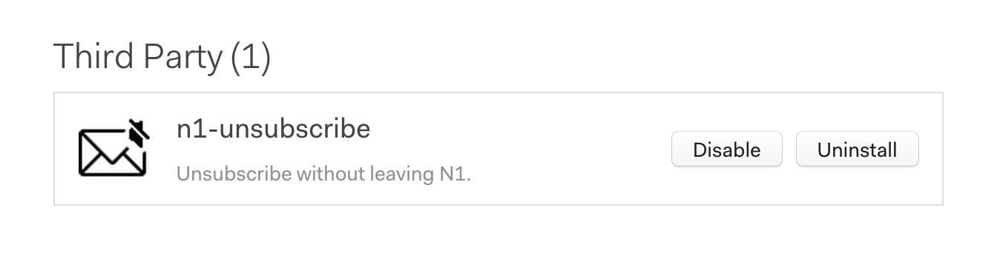

# n1-unsubscribe

This is a plugin for [Nylas N1](https://www.nylas.com/n1) that adds quick unsubscribe functionality.

If you encounter any issues, please report them [here as an issue][issues], so they can be fixed. Have a feature request or great idea? Also submit them through the issues pane and we will take a look as quickly as possible!

## Overview

- Quick action and Toolbar unsubscribe buttons
- Automated unsubscribe request for most email marketers
- Otherwise, opens a Browser Window within N1 for manual unsubscribing
- Auto-trash email after success

## Install this plugin

###### NOTE: Make sure that the downloaded folder is named `n1-unsubscribe` or you may encounter missing icons as mentioned in [#12](https://github.com/colinking/n1-unsubscribe/issues/12).

#### Via Releases

1. [Install N1](https://www.nylas.com/n1)

2. Download and un-zip `n1-unsubscribe.zip` from the [Releases page](https://github.com/colinking/n1-unsubscribe/releases/latest).

3. Install the plugin by either:
    - Selecting `Developer > Install a Plugin Manually...` from the N1 menubar, and then selecting the downloaded folder, `n1-unsubscribe`
    - Or by running the install script from the command line with `make install`

4. You should see the plugin in the plugins pane in N1 (Preferences > Plugins).

#### Via Git

1. Clone this repository: `git clone https://github.com/colinking/n1-unsubscribe.git`

2. Install the package by running the install script: `make install`

3. Reload Nylas (<kbd>Alt</kbd> + <kbd>Cmd</kbd> + <kbd>L</kbd>) and you should see the plugin in the plugins pane in N1 (Preferences > Plugins) [as shown above]

4. To update to the newest version, pull the newest commit and re-run the install script: `git pull && make install`

## Settings
Certain features for this package can be toggled by changing the appropriate settings from within [`unsubscribe-settings.json`](https://github.com/colinking/n1-unsubscribe/blob/master/unsubscribe-settings.json).

To change any of these settings, first install the package, then modify `~/.nylas/packages/unsubscribe-settings.json`. To update your settings in the app, just reload N1 (<kbd>Alt</kbd> + <kbd>Cmd</kbd> + <kbd>L</kbd> or Developer > Reload).

- **use_browser**: Toggle between opening web-based unsubscribe links in your native browser or an in-app pop-up window (default: pop-up).
- **handle_threads**: Toggle between automatically archiving, trashing or not moving your email anywhere after unsubscibing (default: archive).
- **confirm_for_email**: Toggle a confirmation box on or off before sending an automatic unsubscribe email (default: off).
- **confirm_for_browser**: Toggle a confirmation box on or off before opening a browser window to unsubscribe from an email (default: off).

More documentation of these toggles is available in the settings file.

## Behind the Scenes

We use the list-unsubscribe header that is invisibly attached to most marketing emails. If there is no header, we scour the email body for an unsubscribe link or a phrase describing how to unsubscribe. Once a link is found, either an automated email will be sent or a mini browser will appear that will allow you to quickly unsubscribe without leaving N1. The email is trashed for you once this completes. An important note, if no unsubscribe action is available, the button will be hidden.

<!--#### Bulk Action-->

<!--(To Be Developed)-->

<!---->

#### Quick Action

From the comfort of your inbox view, you can easily unsubscribe from an email by tapping the new icon alongside the trash and archive buttons that you are used to. If no unsubscribe action is available, the button will be hidden.

#### Menu Item

While reading an email you may realize that you would like to unsubscribe, so instead of scrolling to the bottom of the email and playing the *spot the unsubscribe link game*, which is [an actual game](http://spottheunsubscribe.tumblr.com/), you can press the obvious button at the top.

## Future Features of n1-unsubscribe
- [ ] Undo unsubscribe action
- [ ] Edge case support
- [ ] Method to report a failed unsubscribe request

## Other possible features
- Better notification of in-progress unsubscribe
- Add a bulk-unsubscribe toolbar button that is enabled when selecting multiple emails
- Tests
- Travis CI and stricter linting?

## Made by
[Kyle King](http://kyleking.me) and [Colin King](http://colinking.co)

[Also StartupHealth is a great organization, they just happened to be at the top of my inbox](https://www.startuphealth.com/)

[issues]: https://github.com/colinking/n1-unsubscribe/issues
