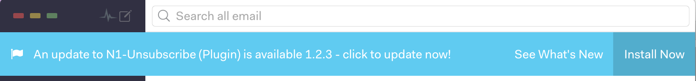

# N1-Unsubscribe (Nylas Plugin)
[](https://travis-ci.org/colinking/n1-unsubscribe)
<a href="https://github.com/nylas/N1">
    
</a>

<!--  [Last Release Downloads](https://img.shields.io/github/downloads/colinking/n1-unsubscribe/latest/total.svg) -->

Quickly unsubscribe from emails with the N1-Unsubscribe plugin for [Nylas N1](https://www.nylas.com/n1).


## The Plugin Magic

N1-Unsubscribe acts in one of two ways. First, it looks if it can unsubscribe via email. If it can, the plugin will send an unsubscribe request email on your behalf. Second, if no email is available, the plugin looks for a link in the body of the email, such as "click to unsubscribe." The plugin can then open the link in a mini-browser to complete the unsubscription without leaving Nylas. When unsubscribed, the email is then trashed or archived based on your selected option ([see settings below](https://github.com/colinking/n1-unsubscribe#settings)).

## How to install

<!-- [](https://github.com/colinking/n1-unsubscribe/raw/master/dist/n1-unsubscribe.zip) -->

1. Download and unzip `n1-unsubscribe.zip` from the [Releases page](https://github.com/colinking/n1-unsubscribe/releases/latest).

2. In N1, Select the menu bar option `Developer > Install a Plugin...`, then select the unzipped folder, `n1-unsubscribe`

3. You should now see the plugin in the plugins pane in N1 (`Preferences > Plugins`).


## The Icons

-  Loading -- wait for a moment for the icon to update
-  Ready to unsubscribe and waiting on your click
-  You are now unsubscribed!
-  When something goes wrong, you will get this error icon. Make sure to forward us the email causing you problems to [n1.unsubscribe@gmail.com](mailto:n1.unsubscribe@gmail.com) and we will try to see what went wrong!

## Settings

Certain features for this package can be toggled by changing the appropriate settings from within `unsubscribe-settings.json`. The settings file isn't tracked, so once you edit it, your preferences will be saved even when updating. You can see the default file here: [`unsubscribe-settings.defaults.json`](https://raw.githubusercontent.com/colinking/n1-unsubscribe/master/unsubscribe-settings.defaults.json).

To change any of these settings, first install the package and modify `~/.nylas/packages/unsubscribe-settings.json`. To update your settings in the app, just reload N1 (<kbd>Alt</kbd> + <kbd>Cmd</kbd> + <kbd>L</kbd> or `Developer > Reload`).

- **use_browser**: Toggle between opening web-based unsubscribe links in your native browser or an in-app pop-up window (default: pop-up).
- **handle_threads**: Toggle between automatically archiving, trashing or not moving your email anywhere after unsubscribing (default: archive).
- **confirm_for_email**: Toggle a confirmation box on or off before sending an automatic unsubscribe email (default: off).
- **confirm_for_browser**: Toggle a confirmation box on or off before opening a browser window to unsubscribe from an email (default: off).

More documentation of these toggles is available in the settings file.

## Keyboard Shortcuts

N1-Unsubscribe now supports keyboard shortcuts! Press <kbd>CMD</kbd> + <kbd>ALT</kbd> + <kbd>U</kbd> when viewing a single email instead of pressing the button. Unsubscribing couldn't be faster. If you want to map your own shortcut keys:

1. Go to:`Nylas->Preferences`
2. Click the `shortcuts` tab
3. Then scroll to the bottom and click the `Edit Custom Shortcuts` button
4. From the finder window, open keymap.json in a text editor and add this snippet (replace `mod+j` with whatever shortcut you want - note mod is the super key on a Mac/PC):

    For keymap.json:
    ```json
    {
      "n1-unsubscribe:unsubscribe": "mod+j"
    }
    ```
    **Alterantively** if you use Keymap.cson, you know what to do!

## Always Stay Up To Date

Whenever an update is released, you will get a native notification. If you would like to add the same banner to your application, see our related NPM package - [n1pluginupdater](https://github.com/KyleKing/n1pluginupdater)



## Reporting Bugs

- **Feature Requests or Bug Reports**: Submit them through the [issues pane][issues]
- **Mishandled Emails**: Find something that doesn't work (not finding an unsubscribe link, etc.)? Forward the email to us at <a href="mailto:n1.unsubscribe@gmail.com">n1.unsubscribe@gmail.com</a> and we will look into it

## Want to learn more?

Do you want to install via git? Want to learn more about how N1-Unsubscribe works? [Check out the extended guide](CONTRIBUTING.md)

## Made by
[Kyle King](http://kyleking.me) and [Colin King](http://colinking.co)

[issues]: https://github.com/colinking/n1-unsubscribe/issues
